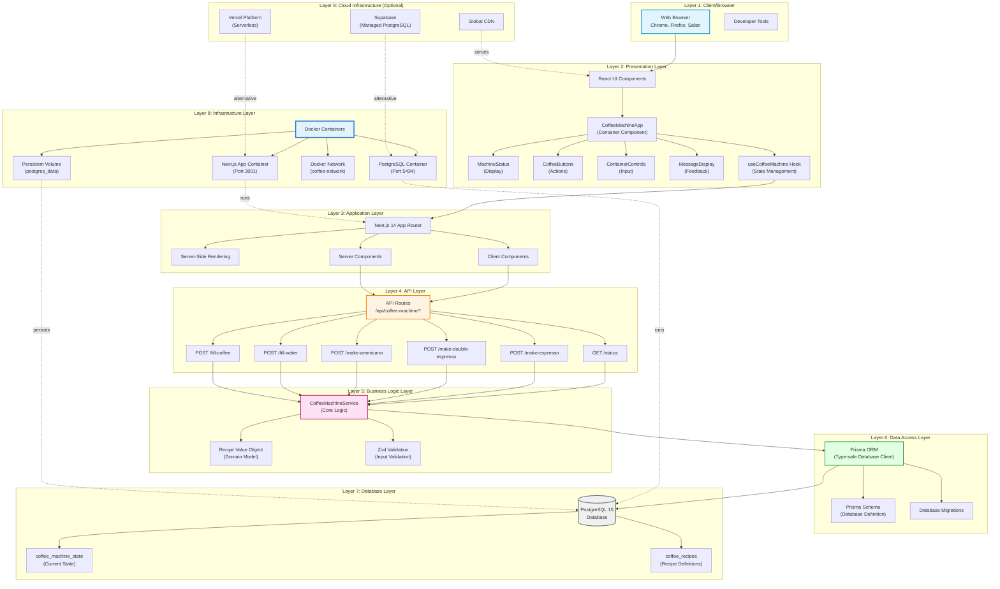
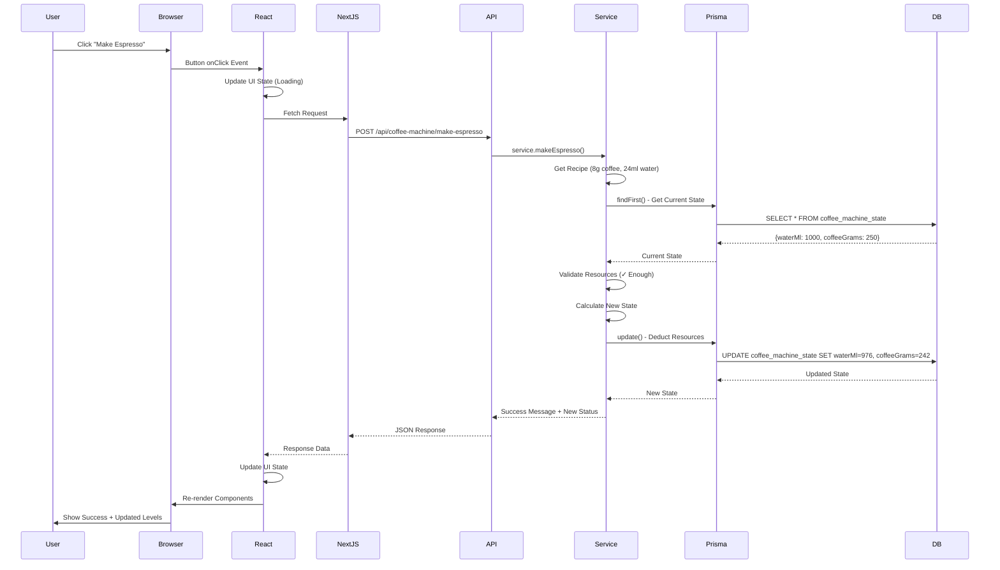
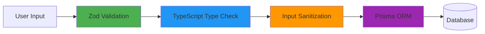
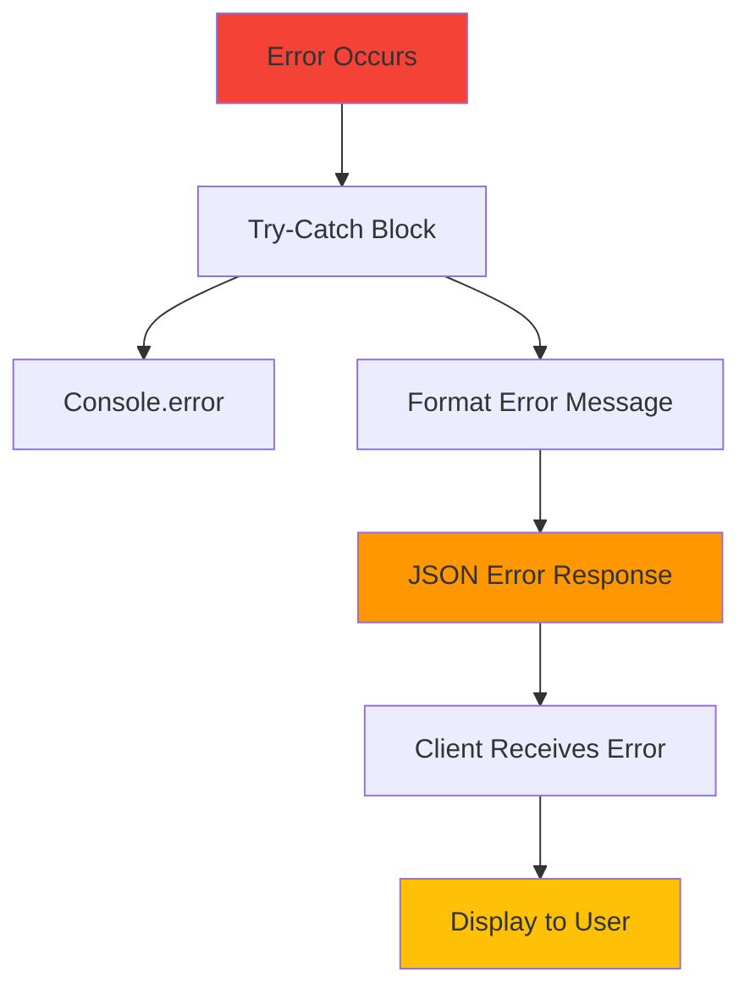
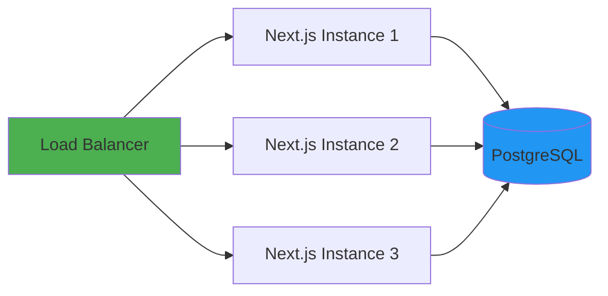
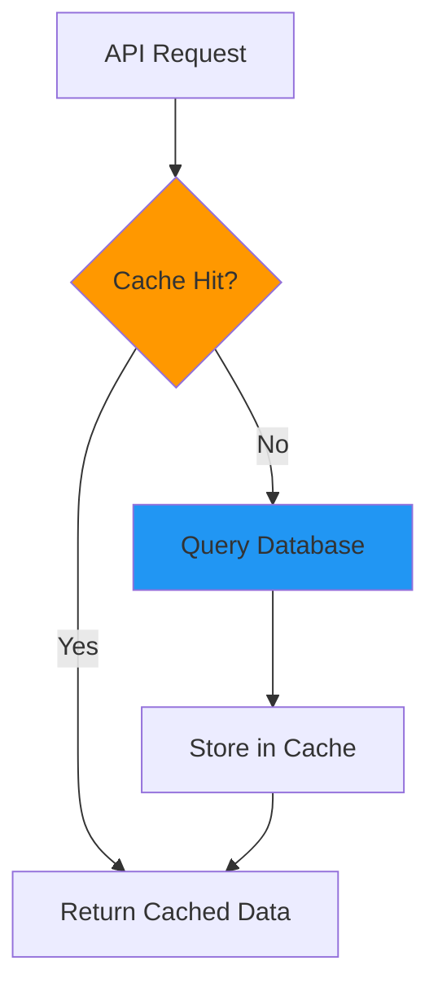

# Coffee Machine - Architecture Layers Presentation

Complete architecture visualization showing all layers from client to infrastructure.

## 🏗️ Complete Architecture Layers



## 📊 Layer Responsibilities

### **Layer 1: Client/Browser**
- **Purpose**: User interface rendering and interaction
- **Technology**: Modern web browsers
- **Responsibilities**:
  - Render React components
  - Handle user input
  - Execute JavaScript
  - Manage local state

### **Layer 2: Presentation Layer**
- **Purpose**: UI components and user interaction logic
- **Technology**: React 18, TypeScript, Tailwind CSS
- **Components**:
  - `CoffeeMachineApp`: Main container component
  - `MachineStatus`: Display water/coffee levels with progress bars
  - `CoffeeButtons`: Coffee type selection buttons
  - `ContainerControls`: Fill water/coffee inputs
  - `MessageDisplay`: Success/error notifications
  - `useCoffeeMachine`: Custom React hook for state management

### **Layer 3: Application Layer**
- **Purpose**: Next.js framework orchestration
- **Technology**: Next.js 14 App Router
- **Features**:
  - Server-Side Rendering (SSR)
  - Client Components (interactive)
  - Server Components (data fetching)
  - Routing and navigation
  - Code splitting

### **Layer 4: API Layer**
- **Purpose**: RESTful API endpoints
- **Technology**: Next.js API Routes
- **Endpoints**:
  - `GET /api/coffee-machine/status` - Get machine status
  - `POST /api/coffee-machine/make-espresso` - Make espresso
  - `POST /api/coffee-machine/make-double-espresso` - Make double espresso
  - `POST /api/coffee-machine/make-americano` - Make americano
  - `POST /api/coffee-machine/fill-water` - Fill water container
  - `POST /api/coffee-machine/fill-coffee` - Fill coffee container

### **Layer 5: Business Logic Layer**
- **Purpose**: Core application logic and domain models
- **Technology**: TypeScript classes and functions
- **Components**:
  - `CoffeeMachineService`: Coffee machine operations
  - `Recipe`: Value object for coffee recipes
  - `Zod Validation`: Input/output validation schemas

### **Layer 6: Data Access Layer**
- **Purpose**: Database abstraction and type safety
- **Technology**: Prisma ORM
- **Features**:
  - Type-safe database queries
  - Schema management
  - Migration system
  - Query builder

### **Layer 7: Database Layer**
- **Purpose**: Data persistence
- **Technology**: PostgreSQL 15
- **Tables**:
  - `coffee_machine_state`: Current water/coffee levels
  - `coffee_recipes`: Recipe definitions

### **Layer 8: Infrastructure Layer**
- **Purpose**: Containerization and deployment
- **Technology**: Docker, Docker Compose
- **Components**:
  - Next.js application container
  - PostgreSQL database container
  - Docker network for communication
  - Persistent volume for data

### **Layer 9: Cloud Infrastructure**
- **Purpose**: Production deployment (optional)
- **Technology**: Vercel, Supabase
- **Features**:
  - Serverless deployment
  - Managed database
  - Global CDN
  - Auto-scaling

## 🔄 Data Flow Diagram



## 🏛️ Architectural Patterns

### **1. Layered Architecture**
```
┌─────────────────────────────────┐
│   Presentation Layer            │
├─────────────────────────────────┤
│   Application Layer             │
├─────────────────────────────────┤
│   Business Logic Layer          │
├─────────────────────────────────┤
│   Data Access Layer             │
├─────────────────────────────────┤
│   Database Layer                │
└─────────────────────────────────┘
```

### **2. Service Layer Pattern**
```typescript
CoffeeMachineService
├── Business Logic
├── Validation
├── State Management
└── Database Operations
```

### **3. Repository Pattern (via Prisma)**
```typescript
Prisma ORM
├── Type-safe Queries
├── Schema Management
├── Migration System
└── Connection Pooling
```

### **4. Value Object Pattern**
```typescript
Recipe
├── Immutable Properties
├── Validation Logic
├── Business Rules
└── Encapsulation
```

## 🔐 Cross-Cutting Concerns

### **Security**


### **Error Handling**


### **Logging & Monitoring**
```
Application Logs
├── API Request/Response
├── Error Tracking
├── Performance Metrics
└── Database Queries
```

## 📈 Scalability Considerations

### **Horizontal Scaling**


### **Caching Strategy**


## 🎯 Design Principles Applied

### **SOLID Principles**
- ✅ **Single Responsibility**: Each layer has one purpose
- ✅ **Open/Closed**: Extensible without modification
- ✅ **Liskov Substitution**: Interfaces are substitutable
- ✅ **Interface Segregation**: Small, focused interfaces
- ✅ **Dependency Inversion**: Depend on abstractions

### **Clean Architecture**
- ✅ **Independence of Frameworks**: Business logic isolated
- ✅ **Testability**: Each layer independently testable
- ✅ **Independence of UI**: UI can be swapped
- ✅ **Independence of Database**: Database can be changed
- ✅ **Independence of External Agencies**: No external dependencies in core

## 🚀 Deployment Architecture

### **Development (Docker)**
```
Developer Machine
└── Docker Desktop
    ├── Next.js Container (Port 3001)
    └── PostgreSQL Container (Port 5434)
```

### **Production (Vercel + Supabase)**
```
Internet
└── Vercel CDN
    └── Next.js Serverless Functions
        └── Supabase PostgreSQL
```

---

**This architecture provides:**
- ✅ Clear separation of concerns
- ✅ Scalability and maintainability
- ✅ Testability at every layer
- ✅ Flexibility for future changes
- ✅ Production-ready infrastructure
